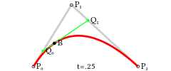

# Bezier Curve 贝塞尔曲线

贝塞尔曲线（Bezier curve）是计算机图形学中相当重要的参数曲线，它通过一个方程来描述一条曲线，根据方程的最高阶数，又分为线性贝赛尔曲线，二次贝塞尔曲线、三次贝塞尔曲线和更高阶的贝塞尔曲线。

**二次贝塞尔曲线**

二次贝塞尔曲线由三个点P0,P1,P2来确定，这些点也被称作控制点。曲线的方程为：

> 

这个方程其实有它的几何意义，它表示可以通过这样的步骤来绘制一条曲线：

* 选定一个0-1的t值
* 通过P0和P1计算出点Q0，Q0在P0 P1连成的直线上，并且length( P0, Q0 ) = length( P0, P1 ) * t
* 同样，通过P1和P2计算出Q1，使得length( P1, Q1 ) = length( P1, P2 ) * t
再重复一次这个步骤，通过Q1和Q2计算出B，使得length( Q0, Q1 ) = length( Q0, B ) * t。B就为当前曲线上的点

注：上面的length表示两点之间的长度

如果将t的值从0过渡到1，不断计算点B，就可以得到一条二次贝塞尔曲线：

**三次贝塞尔曲线**

同样，将t的值从0过渡到1，就可以绘制出一条三次贝塞尔曲线：

**算法**

递归算出每两个点之间的控制线(上图先绿线后蓝线)，最终计算控制线上的B点

    private Point GetPoint(double t, params Point[] points)
    {
        if (points.Length == 2)
        {
            var v = (points[1] - points[0]) * t;
            var b = points[0] + v;
            return b;
        }

        Point[] output = new Point[points.Length - 1];
        for (int i = 0; i < points.Length - 1; i++)
            output[i] = GetPoint(t, new Point[] { points[i], points[i + 1] });

        return GetPoint(t, output);
    }

画线方法

    private void GenerateCurve(params Point[] points)
    {
        int theta = 500;

        foreach (Point p in points)
        {
            this.Points.Points.Add(p);
        }

        for (int i = 0; i <= theta; i++)
        {
            var t = 1.0 / theta * i;

            this.Curve.Points.Add(GetPoint(t, points));
        }
    }

theta是点与点之间递进的粒度，数值越大曲线越平滑
